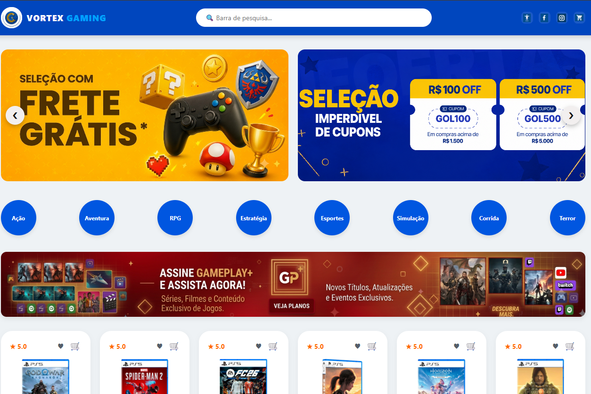
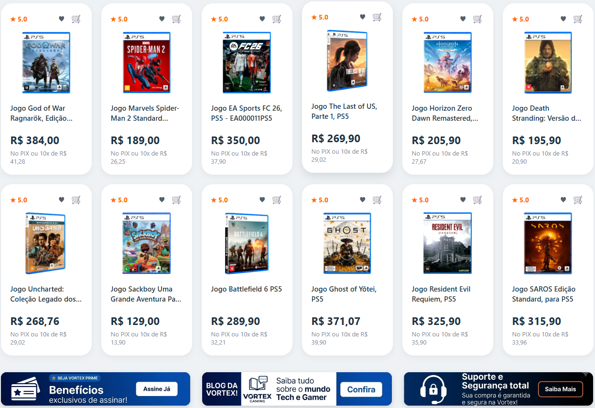

<div align="center">

# 🎮 Vortex Gaming — E-Commerce & Support Hub


<p>
  Plataforma web completa composta por uma vitrine de e-commerce de jogos digitais e uma central de suporte ao cliente. Projeto desenvolvido com foco em HTML5 semântico, arquitetura CSS moderna e experiência do usuário (UX).
</p>

</div>

---

## 📸 Demonstração do Projeto

<div align="center">
  <p><b>1. Tela Inicial</b></p>
  
  <br/><br/>
  
</div>


---

## 📌 Sobre o Projeto

A **Vortex Gaming** foi concebida para simular uma experiência real de e-commerce voltada para o público gamer. A aplicação abrange desde a descoberta de títulos (com filtros por gênero e destaque para promoções) até o ecossistema de suporte pós-venda com perguntas frequentes e múltiplos canais de contato.

---

## 📄 Estrutura de Páginas & Funcionalidades

| Página                             | Destaques & Recursos                                                                                                                                                                                                                 |
| :--------------------------------- | :----------------------------------------------------------------------------------------------------------------------------------------------------------------------------------------------------------------------------------- |
| **`index.html`** _(Loja)_          | • Header com busca, redes sociais e carrinho.<br>• Banner promocional (Hero) e filtro por gêneros de jogos.<br>• Vitrine em grid com 12 jogos, avaliações, parcelamento e favoritar.<br>• Captura de leads via newsletter no footer. |
| **`contato.html`** _(Atendimento)_ | • Campo de busca dedicado para dúvidas rápidas.<br>• FAQ interativo para questões de pagamento e prazos.<br>• Cards de atendimento via Chat (com indicador _Online_), E-mail e Telefone.                                             |

---

## 📁 Estrutura do Repositório

```text
LOJA_GAMES/
├── imagens/ 
├── contato.html
├── index.html
├── README.md
└── style.css
```
